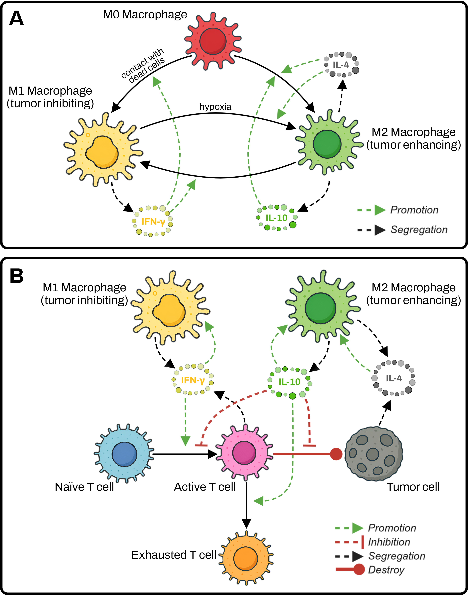
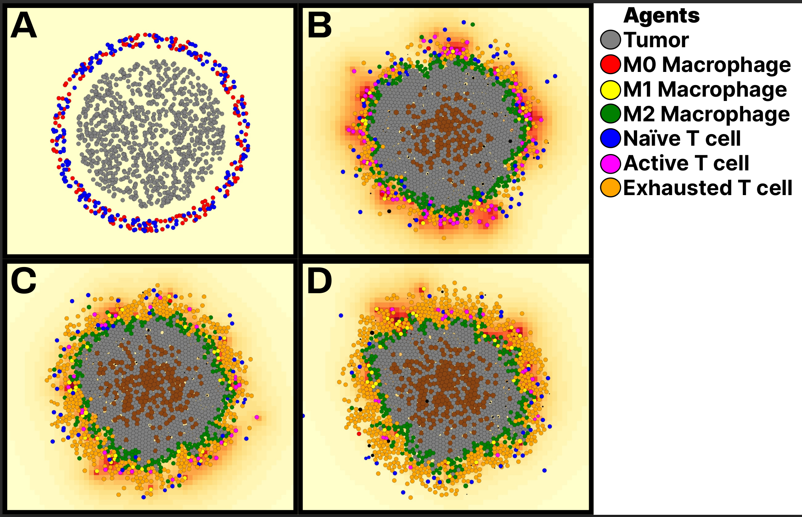
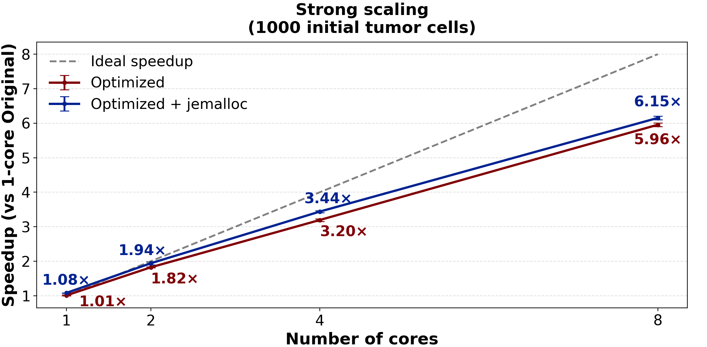
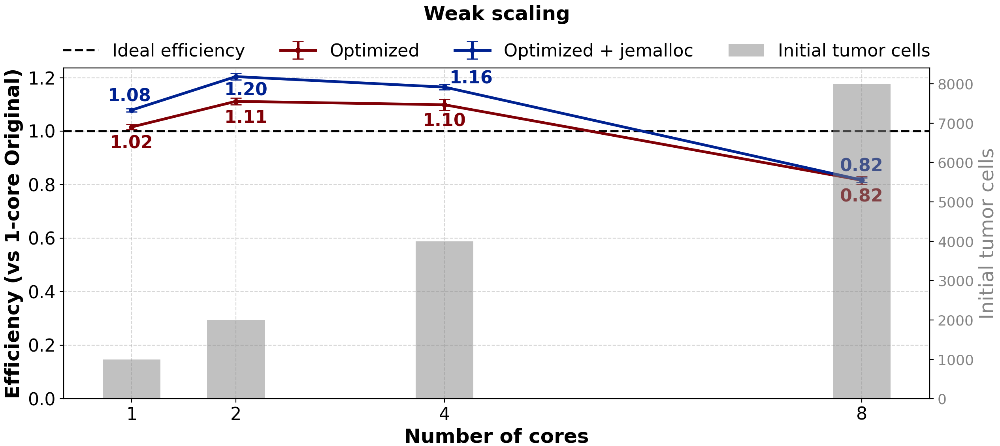
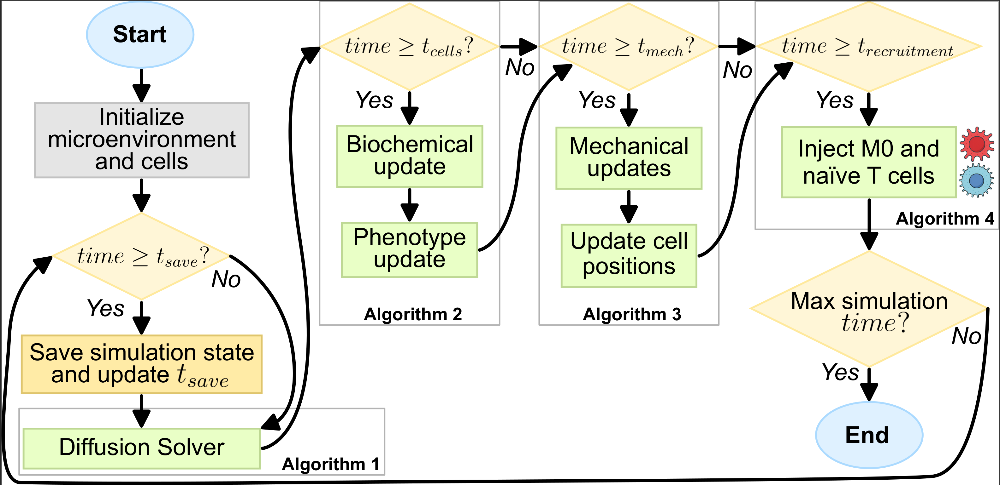
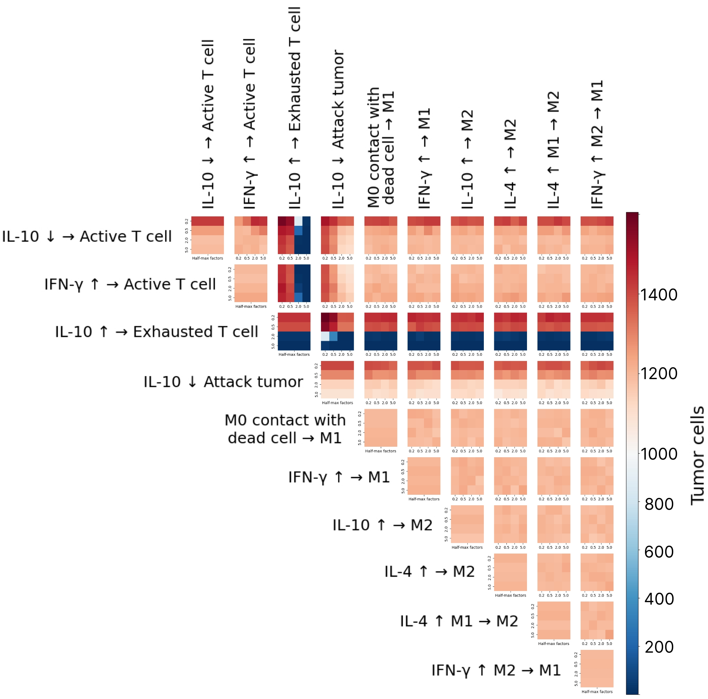
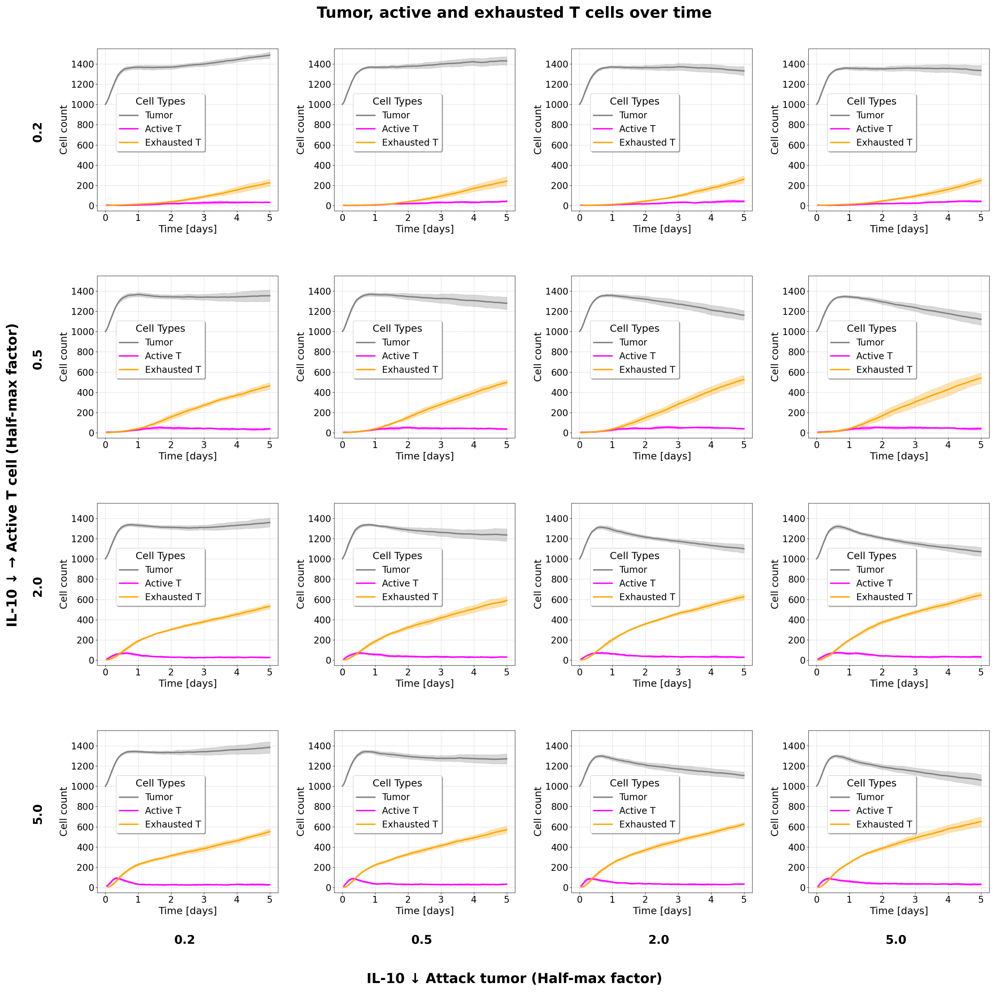
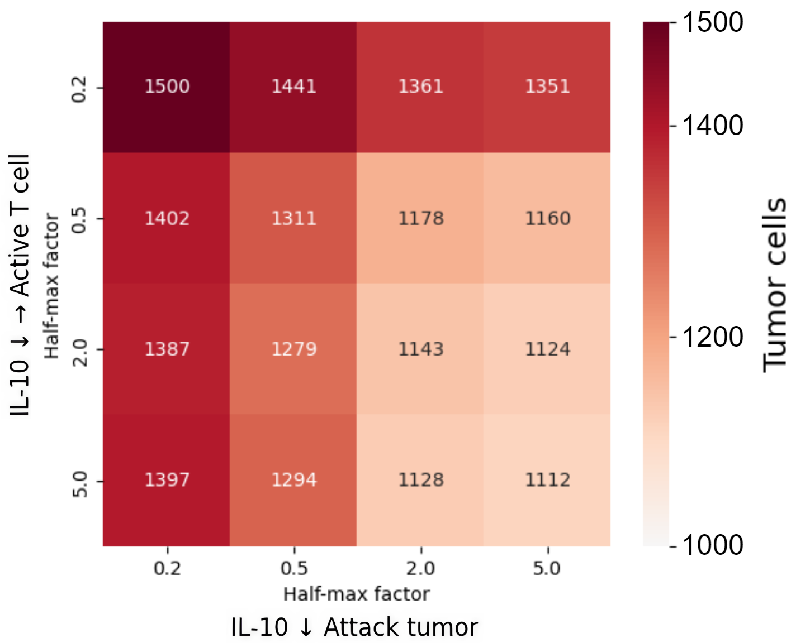
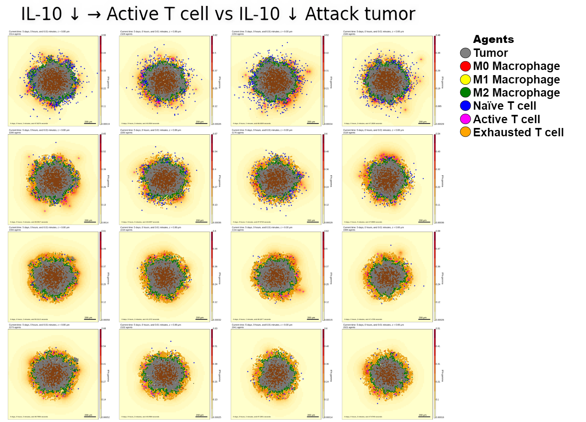

# PhysiCell-based Tumor Immunosurveillance Model

This repository contains a parallel, off-lattice, agent-based model of tumor immunosurveillance implemented in PhysiCell. The model extends the Cess-Finley framework by incorporating detailed immunoregulatory rules, including IL-10 and hypoxia signaling, to simulate the complex dynamics of the tumor microenvironment.

The project focuses on two key areas:
1.  **Computational Performance:** Optimizing the simulation for high-throughput analysis using OpenMP parallelization.
2.  **Biological Insights:** Using a Multi-Parameter Sensitivity Analysis (MPSA) to identify the most influential signaling pathways that regulate tumor growth and immune response.

This work has been presented in the following article:
- Rodriguez-Gallegos, E. R., et al. (2025). *An Off-Lattice Parallel Algorithm for Tumor Immunosurveillance Based on Cess–Finley Model*. 2025 IEEE International Autumn Meeting on Power, Electronics and Computing (ROPEC).

## Model Description

The model simulates the interactions between tumor cells, macrophages (M0, M1, M2), and T cells (naive, active, exhausted) in a 2D environment. Cell behavior is governed by a set of 31 rules based on the cell behavior grammar proposed by Johnson et al., which use Hill-type functions to capture nonlinear signaling responses to cytokines (IL-4, IFN-γ, IL-10) and local cell-cell contact.


*Schematic of the extended Cess-Finley model. (A) Macrophage differentiation pathways. (B) Cell interaction network.*

A custom immune cell recruitment mechanism is implemented, where naive T cell infiltration is triggered by tumor cell death (Michaelis-Menten kinetics) and M0 macrophage recruitment is proportional to the live tumor cell count.

### Baseline Simulation
The following snapshots show a baseline simulation with 1,000 tumor cells (grey), 200 M0 macrophages (red), and 200 naive T cells (blue) over 120 virtual hours.



## Key Results

### Computational Performance
The PhysiCell framework was optimized by enforcing a `schedule(static)` policy in OpenMP regions and using the `jemalloc` memory allocator. These targeted optimizations significantly improved performance without compromising the portability of the framework.

**Strong and Weak Scaling**
The optimizations achieved a **6.15x speedup** on 8 CPU cores in strong scaling tests. In weak scaling tests, the model maintained **82% efficiency**, demonstrating its capability to handle increasing workloads.

 | 
:---:|:---:
*Strong scaling results showing speedup relative to the original single-core baseline.* | *Weak scaling results showing parallel efficiency as workload increases with core count.*

These performance gains reduced the runtime of the Multi-Parameter Sensitivity Analysis from over 32 days to under 8 days. The complete simulation workflow is outlined below:



### Biological Insights: Multi-Parameter Sensitivity Analysis (MPSA)
A 7,600-run MPSA was conducted to identify the most critical rules governing tumor fate. The analysis involved scaling the half-max parameter of 10 key cytokine-mediated rules.


*Heatmap of the MPSA results. Color encodes the average final tumor count, with blue indicating tumor regression and red indicating growth.*

The MPSA revealed that **IL-10 signaling is the dominant regulator of tumor burden**. Specifically, rules governing IL-10-mediated T cell exhaustion were the most sensitive. Modulating the sensitivity of T cells to IL-10 (by increasing the half-max parameter) halved the final tumor count, suggesting a potent therapeutic target.

### Additional Simulation Results
The following images show further results from the MPSA, comparing different rule sensitivities and their impact on the simulation dynamics.

**MPSA Time-course Dynamics**

*A grid of time-series plots from the MPSA, showing cell population dynamics over 5 days. The axes vary the sensitivities for IL-10's inhibition of T cell activation and its inhibition of tumor attack, highlighting how these rules shape the tumor's growth trajectory.*

**Rule Comparison: M1 vs. M2 Polarization**
These results compare the impact of two different M0 macrophage polarization rules on the overall cell population dynamics and spatial distribution.

*Average final agent counts comparing two different rule sets.*


*Final simulation snapshots comparing the spatial outcomes of the two rule sets.*

## How to Run the Model
To use this model:
1. Clone or download this repository.
2. From a terminal, navigate to the repository directory.
3. Run the model-specific commands to load the model and run the simulation.

The general command is:
```sh
make load PROJ=Extended_Cess_Finley_model && make && ./project
```
This command loads the extended tumor-immune model, compiles it, and runs a simulation with the default configuration file (`config/PhysiCell_settings.xml`).

### Viewing Results
The simulation results can be explored interactively using [PhysiCell-Studio](https://github.com/PhysiCell-Tools/PhysiCell-Studio). After starting the simulation, open a new terminal and run:
```sh
python <path/to/studio/bin/studio.py> -c config/PhysiCell_settings.xml -e ./project
```
Navigate to the `Plots` tab in the Studio GUI to visualize the simulation output.

## Citation
If you use this model in your research, please cite the following publication:

```bibtex
@inproceedings{rodriguez2025ropec,
  title={An Off-Lattice Parallel Algorithm for Tumor Immunosurveillance Based on Cess–Finley Model},
  author={Rodriguez-Gallegos, Eduardo R. and Perez-Sansalvador, Julio C. and Rodriguez-Gomez, Gustavo and Pomares-Hernandez, Saul E.},
  booktitle={2025 IEEE International Autumn Meeting on Power, Electronics and Computing (ROPEC)},
  year={2025},
  organization={IEEE}
}
```
